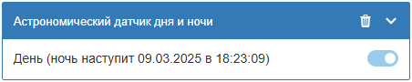
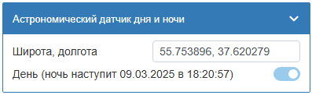

# WB-Lighting-control
Набор файлов для WirenBoard, позволяющий связать контролы, управляющие источниками света, работающими как датчики освещенности, движения или мастер-выключателями с местами иерархического списка, подготавливаемого с помощью [WB-Location-settings](https://github.com/vitp77/WB-Locations-settings).
## Предоставляемые возможности управления освещением:
1. Задавать мастер-выключатели для групп освещения как виртуальные так и спланированные физические выключатели, подключенные к устройству WirenBoard
2. Задавать сценарии с автоматическим включением и отключением по датчику освещенности
3. Задавать сценарии на подобии "Темная комната" с включением освещения по датчикам движения (присутствия), датчикам открывания дверей с отключением через заданный промежуток времени, если присутствия более не обнаруживается
4. Задавать сценарии включения освещения на заданный промежуток времени
5. Использовать астрономический датчик для и ночи в сценариях (используется библиотека [SunCalc, Владимира Агафонкина](https://github.com/mourner/suncalc))

Поддерживается сценарий при автоматическом отключении диммируемых источников света, когда за 5 секунд до отключения снижается яркость источников на 30% от установленных значений, тем самым предупреждая об отключении.
Если в этот промежуток времени (5 секунд) или в течении 5 секунд после отключения света подать признаки присутствия - сценарий включится на удвоенный промежуток времени.

## Таблица сценариев:
| № п.п |Датчики присутствия|Датчик освещенности|Таймер|Описание|Сценарий|
|-------|-------------------|-------------------|------|--------|--------|
|1      |                   |                   |      |Освещение управляется только выключателями|Нет сценария|
|2      |                   |+                  |      |Включается по датчику освещения, свет горит пока датчик освещенности активен +5 секунд|Сумеречный выключатель (5 секунд может оказаться недостаточно для фильтрации засветов)|
|3      |+                  |                   |      |Включается по датчикам движения, свет горит пока датчики присутствия активны + 5 секунд|??|
|4      |+                  |+                  |      |Включается по датчика движения только если активен датчик освещенности, свет горит пока датчики присутствия активны + 5 секунд|Возможно, лестничная клетка|
|5      |                   |                   |+     |Освещение управляется только выключателями, свет горит на время таймера|В кладовке|
|6      |                   |+                  |+     |Включается по датчику освещения, свет горит пока датчик освещения активен + время таймера|Сумеречный выключатель|
|7      |+                  |                   |+     |Включается по датчикам присутствия, свет горит пока датчики присутствия активны + время таймера|Темная комната|
|8      |+                  |+                  |+     |Включается по датчикам присутствия только если активен датчик освещенности, свет горит пока активны датчики присутствия + время таймера|"Серая" комната (только в темное время суток)|
* Датчики присутствия - датчики движения, микроволновые датчики, концевики, герконы ...

## Как попробовать:
1. Перенести папку ```wb-lighting-control``` со всеми файлами в папку ```/mnt/data/etc```.
2. Выполнить скрипт начальной инициализации
 ```bash
/mnt/data/etc/wb-lighting-control/initial-setup.sh
```


## Скрипт управления
Скрипт, обслуживающий настройки освещения создает виртуальное устройство с элементами управления:
- Мастер-выключатели (```Истина``` если включен хотя бы один из источников света в подчиненных местах)
- Элементы управления уровнями яркости источников света (равно значению самого высокого уровня яркости источников света в подчиненных местах), изменение устанавливает единый уровень яркости для всех источников света в подчиненных местах.
  


## Dashboard
В дополнение, по настройкам собирается панель управления освещением.


## Астрономический датчик дня и ночи
На базе библиотеки SunCalc разработал простенький сенсор, который можно использовать в своих скриптах не углубляясь в сложные расчеты.



Можно использовать независимо от всего пакета.



Как использовать:
1. Скопировать приложенный скрипт в папку /mnt/data/etc/wb-rules;
2. Выбрать точку на “Яндекс Карты”;
3. По правой кнопке мыши выбрать пункт “Что здесь?”;
4. В открывшемся окне скопировать координаты;
5. Вставить координаты в поле “Широта, долгота”.
В своих скриптах можно обращаться к сенсору astronomicalDayNightSensor/dayNight. Если его значение Истина - светло (День), если Ложь - Темно (Ночь).
