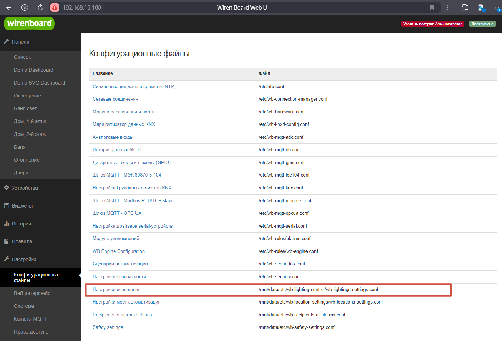
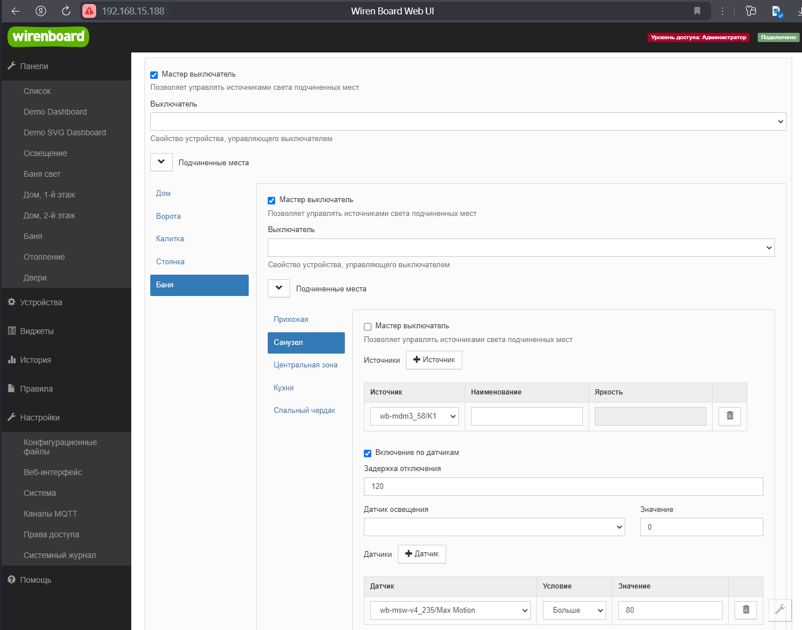
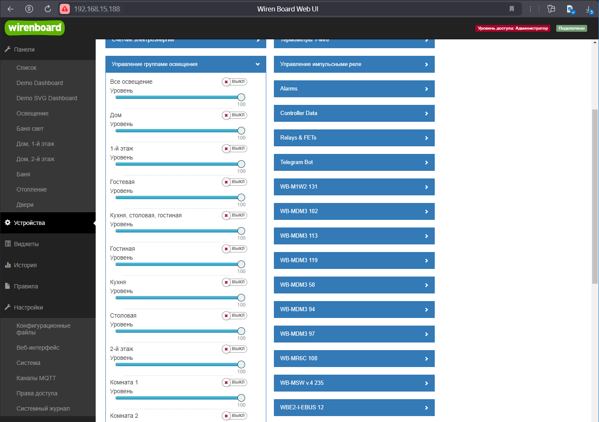
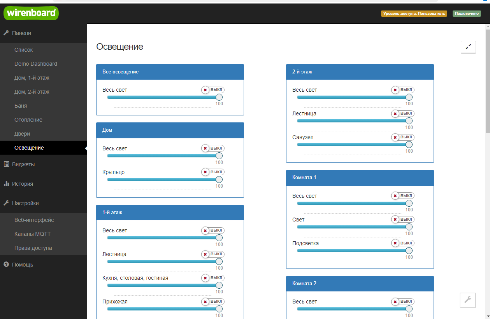

# WB-Lighting-control
Набор файлов для WirenBoard, позволяющий связать контролы, управляющие источниками света, работающими как датчики освещенности, движения или мастер-выключателями с местами иерархического списка, подготавливаемого с помощью [WB-Location-settings](https://github.com/vitp77/WB-Locations-settings).
## Предоставляемые возможности управления освещением:
1. Задавать мастер-выключатели для групп освещения как виртуальные так и спланированные физические контролы устройств WirenBoard
2. Задавать сценарии с автоматическим включением и отключением по датчику освещенности
3. Задавать сценарии на подобии "Темная комната" с включением освещения по датчику движения и отключением через заданный промежуток времени, если движение не обнаруживается
4. Задавать сценарии включения освещения на заданный промежуток времени
5. Использовать астрономический датчи для и ночи в сценариях (используется библиотека [SunCalc, Владимира Агафонкина](https://github.com/mourner/suncalc))

Поддерживается сценарий при автоматическом отключении диммируемых источников света, когда за 5 секунд до отключения снижается яркость источников на 30% от установленных значений, тем самым предупреждая об отключении.

## Как попробовать:
1. Перенести папку ```wb-lighting-control``` со всеми файлами в папку ```/mnt/data/etc```.
2. Выполнить скрипт начальной инициализации
 ```bash
/mnt/data/etc/wb-lighting-control/initial-setup.sh
```



## Скрипт управления
Скрипт, обслуживающий настройки освещения создает виртуальное устройство с элементами управления:
- Мастер-выключатели (```Истина``` если включен хотя бы один из источников света в подчиненных местах)
- Элементы управления уровнями яркости источников света (равно значению самого высокого уровня яркости источников света в подчиненных местах), изменение устанавливает единый уровень яркости для всех источников света в подчиненных местах.
  


## Dashboard
В дополнение, по настройкам собирается панель управления освещением.


